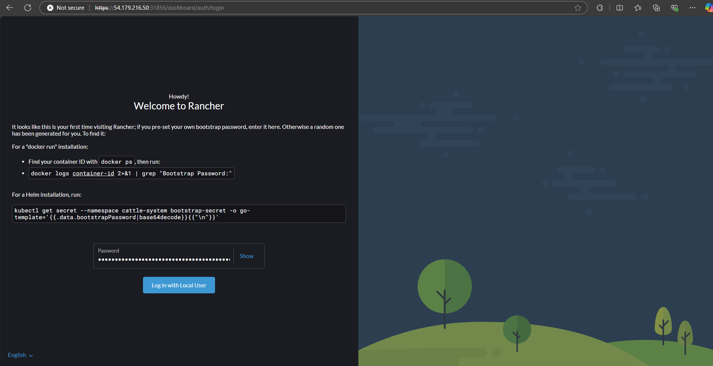
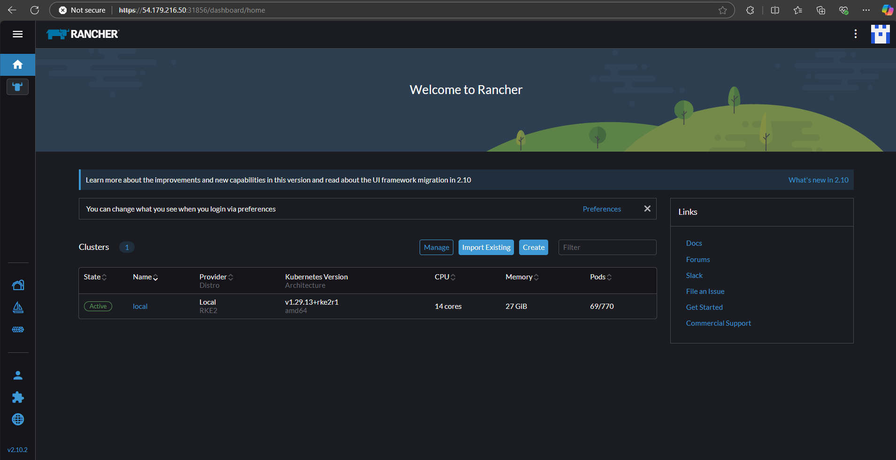

# Install Rancher
*In this tutorial, we will expose rancher with NodePort service type (ignore ingress because don't want to public rancher dashboard to the internet)*

**Install cert-manager**
```
# kubectl apply --validate=false -f https://github.com/cert-manager/cert-manager/releases/download/v1.17.1/cert-manager.yaml
```

**Deploy Rancher**
```
# helm repo add rancher-stable https://releases.rancher.com/server-charts/stable
# helm install rancher rancher-stable/rancher \
  --namespace cattle-system \
  --create-namespace \
  --set ingress.enabled=false \
  --set service.type=NodePort \
  --set replicas=1
```

**Wait a few minutes for the deploy process to complete and the pods to show the status "Running"**
```
# kubectl get all -n cattle-system
NAME                                   READY   STATUS      RESTARTS   AGE
pod/helm-operation-6t75s               0/2     Completed   0          103s
pod/helm-operation-7shwf               0/2     Completed   0          2m
pod/helm-operation-894l8               0/2     Init:0/1    0          12s
pod/helm-operation-qmftt               0/2     Completed   0          67s
pod/helm-operation-t5cfl               0/2     Completed   0          44s
pod/rancher-67df4d7697-289h9           1/1     Running     0          3m37s
pod/rancher-webhook-7cd56ccf6d-dbgq5   1/1     Running     0          40s

NAME                      TYPE        CLUSTER-IP      EXTERNAL-IP   PORT(S)                      AGE
service/rancher           NodePort    10.45.191.20    <none>        80:31442/TCP,443:31856/TCP   3m37s
service/rancher-webhook   ClusterIP   10.45.163.252   <none>        443/TCP                      40s

NAME                              READY   UP-TO-DATE   AVAILABLE   AGE
deployment.apps/rancher           1/1     1            1           3m37s
deployment.apps/rancher-webhook   1/1     1            1           40s

NAME                                         DESIRED   CURRENT   READY   AGE
replicaset.apps/rancher-67df4d7697           1         1         1       3m37s
replicaset.apps/rancher-webhook-7cd56ccf6d   1         1         1       40s
```

**Get Rancher bootstrap password to login first**
```
# kubectl get secret --namespace cattle-system bootstrap-secret -o go-template='{{.data.bootstrapPassword|base64decode}}{{ "\n" }}'
k9wxksd2n8w7qncwlp72d4vtdb49bf5jdtl7vmx8hw6r6crq6n9nmv
```

**Login Rancher UI using bootstrap password to change Rancher "admin" password**

*https://<K8S_NODE_IP>:<RANCHER_NODEPORT>*






